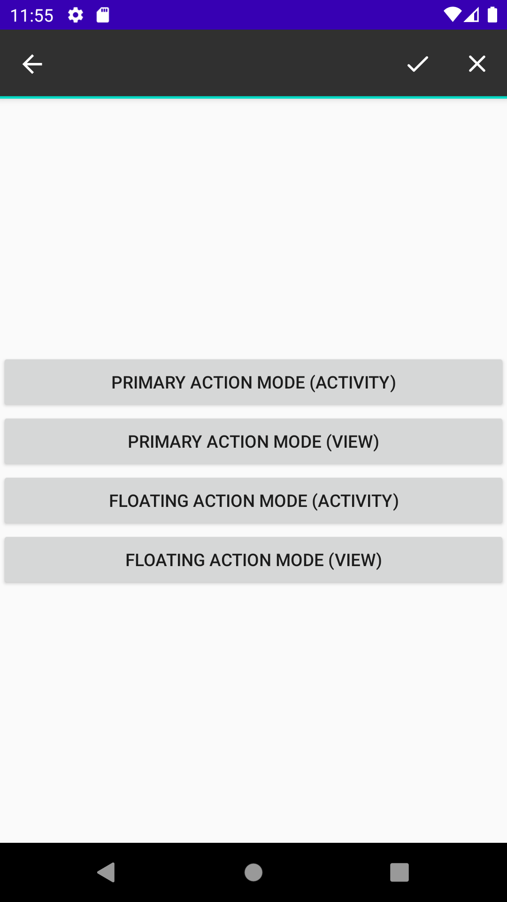
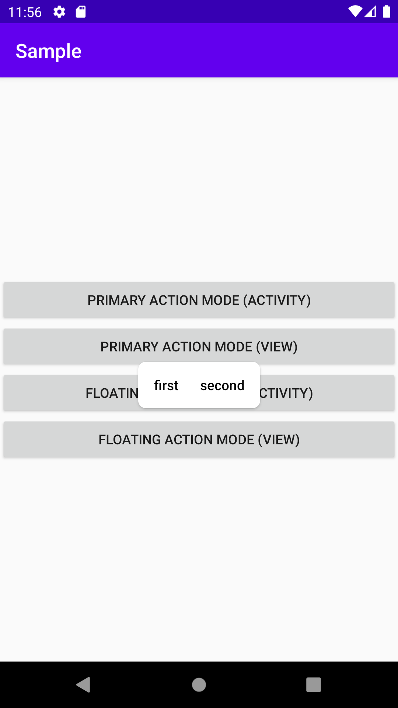
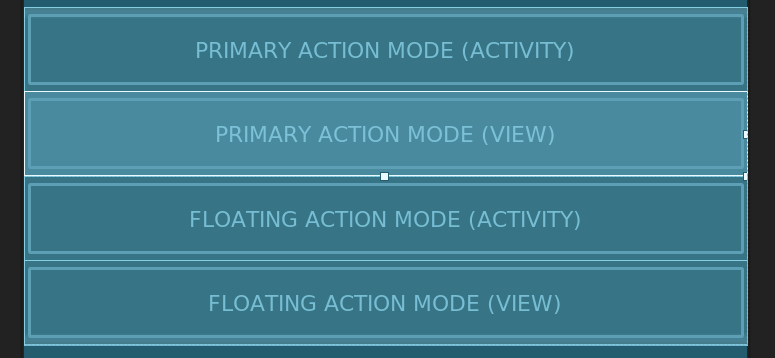

# 2020/09/02 ［Android］ActionMode を楽に実装する

# はじめに

Android には View などをクリックすると View の周りにメニューを表示したり、ActionBar 上にメニューを表示したりできる ActionMode という機能があります。View の周りにメニューを表示する方法を Floating Action と ActionBar 上にメニューを表示する方法を Primary Action と呼びます。今回は Floating Action と Primary Action の両方の ActionMode を使うための実装方法について説明します。

| Primary Action | Floating Action |
| ------- | ------- |
|  |  |


# Action Mode を開始するには
Action Mode は Activity か View に実装されている startActionMode で開始できるようになっています。引数には ActionMode.Callback と ActionMode.Type を渡すようになっています。

```java
public ActionMode startActionMode(android.view.ActionMode.Callback callback, int type)
```

ActionMode.Callback は次のようなインタフェースが定義されており、このクラスを実装することで ActionMode の動作を決めるようになっています。

```java
public interface Callback {
    // アクションモードで表示するメニューを最初に作成するときに呼び出される
    boolean onCreateActionMode(ActionMode var1, Menu var2);
    
    // アクションモードが無効になるたびに、アクションモードのメニュー表示を更新するときに呼び出される。
    boolean onPrepareActionMode(ActionMode var1, Menu var2);
    
    // アクションモードに表示されたメニューをクリックしたときに呼び出される。
    boolean onActionItemClicked(ActionMode var1, MenuItem var2);
    
    // アクションモードから抜けるとき、または破棄するときに呼び出される。
    void onDestroyActionMode(ActionMode var1);
}
```

ActionMode.Type として ActionMode.TYPE_PRIMARY と ActionMode.TYPE_FLOATING が定義されています。ActionMode.TYPE_PRIMARY を渡すと Primary Action、 ActionMode.TYPE_FLOATING を渡すと Floating Action で表示されるようになります。

```java
public abstract class ActionMode {
    public static final int TYPE_FLOATING = 1;
    public static final int TYPE_PRIMARY = 0;
      ︙
}
```

# Action Mode を楽に開始できるようにする

このように startActionMode を利用すれば Action Mode を開始できるようになっています。ですが一から実装するとかなり面倒なので次のようなクラスを作成して Action Mode を使いやすいようにしてやります。

```kotlin
class ActionModeController(
    // 生成するメニューが定義されたリソースID
    @MenuRes private val resId: Int,
    // ActionMode の Type
    private val type: Int,
    // メニューが選択されたときの処理が定義された関数
    private val onAction : (MenuItem) -> Unit
) {
    // Activity から ActionMode を開始する
    fun startActionMode(activity: Activity) {
        activity.startActionMode(createActionModeCallback(), type)
    }

    // View から ActionMode を開始する
    fun startActionMode(view: View) {
        view.startActionMode(createActionModeCallback(), type)
    }

    private fun createActionModeCallback(): ActionMode.Callback {
        return object: ActionMode.Callback {
            override fun onCreateActionMode(mode: ActionMode, menu: Menu): Boolean {
                // リソースIDをInflaterに渡してメニューを生成してやる
                mode.menuInflater.inflate(resId, menu)
                return true
            }

            override fun onPrepareActionMode(mode: ActionMode, menu: Menu): Boolean {
                // 更新されることは想定していないので何もしない
                return false
            }

            override fun onDestroyActionMode(mode: ActionMode) {
                // 破棄時に特にやることは無いので何もしない
            }

            override fun onActionItemClicked(mode: ActionMode, item: MenuItem): Boolean {
                // onAction に MenuItem を渡して選択されたことを通知する
                onAction.invoke(item)
                
                // MenuItem が選択されたあとは Action Mode を終了させる
                mode.finish()
                return true
            }
        }
    }
}
```

# UI を定義して Action Mode を開始する

まずは Action Mode で表示するメニューを定義してやります。次のように２つのメニューが定義された単純なものを定義します。
(必要に応じて strings.xml や drwable にリソースを定義してやってください)


```xml
<?xml version="1.0" encoding="utf-8"?>
<menu xmlns:android="http://schemas.android.com/apk/res/android">
    <item
        android:id="@+id/first"
        android:title="@string/first"
        android:icon="@drawable/ic_done"
        />

    <item
        android:id="@+id/second"
        android:title="@string/second"
        android:icon="@drawable/ic_close"
        />
</menu>
```

あとは Activity や Fragment にて Action Mode を開始する処理を記述すればよいのですが、今回は何通りか Action Mode を試したかったので 4 つのボタンを用意することにしました。



```xml
<?xml version="1.0" encoding="utf-8"?>
<LinearLayout xmlns:android="http://schemas.android.com/apk/res/android"
    xmlns:tools="http://schemas.android.com/tools"
    android:layout_width="match_parent"
    android:layout_height="wrap_content"
    android:layout_gravity="center"
    tools:context=".MainFragment"
    android:orientation="vertical">

        <Button
            android:id="@+id/primary_action_mode_activity_button"
            android:layout_width="match_parent"
            android:layout_height="wrap_content"
            android:text="PRIMARY ACTION MODE (ACTIVITY)"/>

        <Button
            android:id="@+id/primary_action_mode_view_button"
            android:layout_width="match_parent"
            android:layout_height="wrap_content"
            android:text="PRIMARY ACTION MODE (VIEW)"/>

        <Button
            android:id="@+id/floating_action_mode_activity_button"
            android:layout_width="match_parent"
            android:layout_height="wrap_content"
            android:text="FLOATING ACTION MODE (ACTIVITY)"/>

        <Button
            android:id="@+id/floating_action_mode_view_button"
            android:layout_width="match_parent"
            android:layout_height="wrap_content"
            android:text="FLOATING ACTION MODE (VIEW)"/>
</LinearLayout>
```

あとは用意したボタンをクリックしたときに先程作成したクラスを通して Action Mode を開始できるようにしてやります。これで Action Mode が使えるようになります。

```kotlin
class MainFragment : Fragment(R.layout.fragment_main) {
    override fun onViewCreated(view: View, savedInstanceState: Bundle?) {
        super.onViewCreated(view, savedInstanceState)

        // Primary Action の Action Mode を開始するためのコントローラ
        val primaryActionModeController = ActionModeController(R.menu.action_menus, ActionMode.TYPE_PRIMARY) {
            // メニューを選択したときに MenuItem が渡される。
            // 渡された MenuItem に応じて特定の処理を実施してやる
            when (it.itemId) {
                R.id.first -> {
                    Toast.makeText(context, "FIRST", Toast.LENGTH_SHORT).show()
                }
                R.id.second -> {
                    Toast.makeText(context, "SECOND", Toast.LENGTH_SHORT).show()
                }
            }
        }

        // Floating Action の Action Mode を開始するためのコントローラ
        val floatingActionModeController = ActionModeController(R.menu.action_menus, ActionMode.TYPE_FLOATING) {
            when (it.itemId) {
                // メニューを選択したときに MenuItem が渡される。
                // 渡された MenuItem に応じて特定の処理を実施してやる
                R.id.first -> {
                    Toast.makeText(context, "FIRST", Toast.LENGTH_SHORT).show()
                }
                R.id.second -> {
                    Toast.makeText(context, "SECOND", Toast.LENGTH_SHORT).show()
                }
            }
        }

        // Activity を使って Primary Action を表示する
        primary_action_mode_activity_button.setOnClickListener {
            primaryActionModeController.startActionMode(requireActivity())
        }

        // View を使って Primary Action を表示する
        primary_action_mode_view_button.setOnClickListener {
            primaryActionModeController.startActionMode(it)
        }

        // Activity を使って Floating Action を表示する
        floating_action_mode_activity_button.setOnClickListener {
            floatingActionModeController.startActionMode(requireActivity())
        }

        // View を使って Floating Action を表示する
        floating_action_mode_view_button.setOnClickListener {
            floatingActionModeController.startActionMode(it)
        }
    }
}

```

実行してみます。Primary Action だと Activity でも View でも動作が変わらないですね。Floating Action は渡した Activity や View の近くに表示する挙動になるので動作が異なりますね。まぁ Floating Action を使うときには基本クリックしたアイテムに対してメニューを表示しそうなので Activity は使いどころはないかもしれませんね。


# おわりに

ActionMode はなぜか実装例が検索しても出てきづらく難しいのかと思ったらそうでもないです。わかれば簡単な部類なものだと思うのですが古くから存在する機能であるからか Kotlin で書かれた記事が少ないのがわかりづらさを助長している気がします。分解すればわりとわかりやすいインタフェースになっているのでさくっと実装できるようになりましょう。

# 参考文献
- [ActionMode.Callback](https://developer.android.com/reference/android/view/ActionMode.Callback)
- [Using Android’s ActionMode](https://medium.com/over-engineering/using-androids-actionmode-e903181f2ee3)