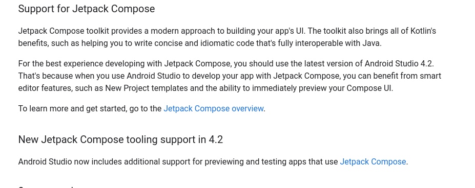
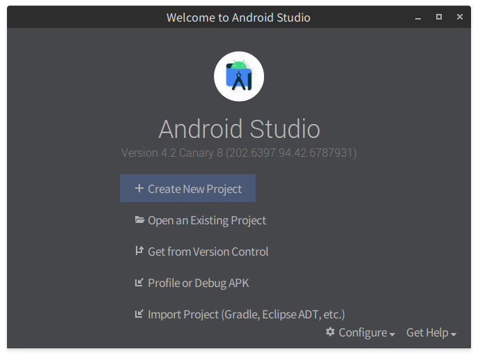
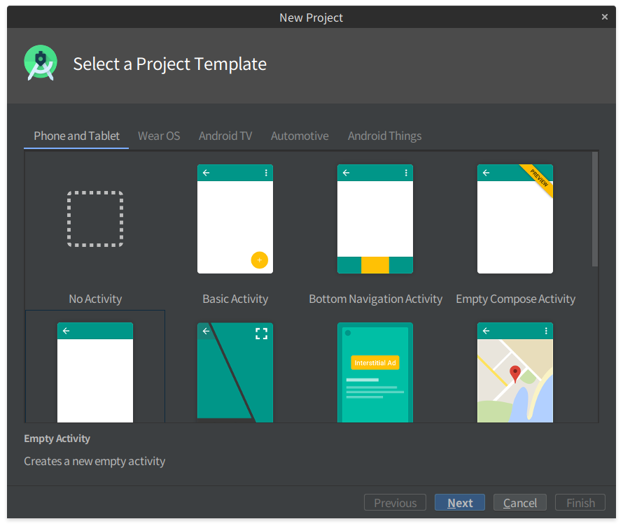
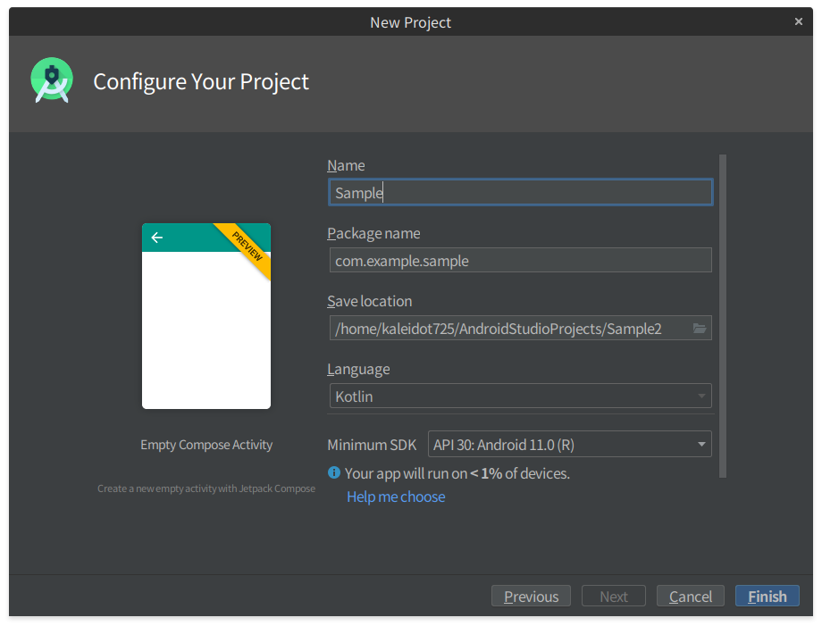
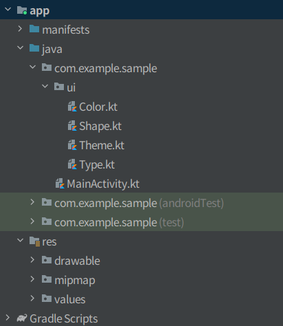
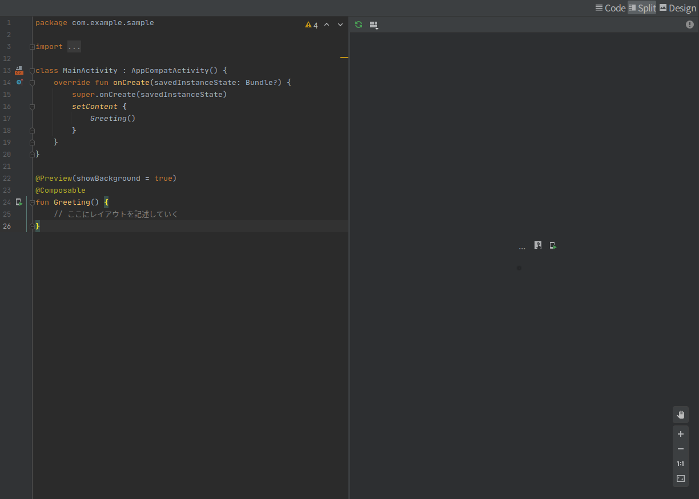
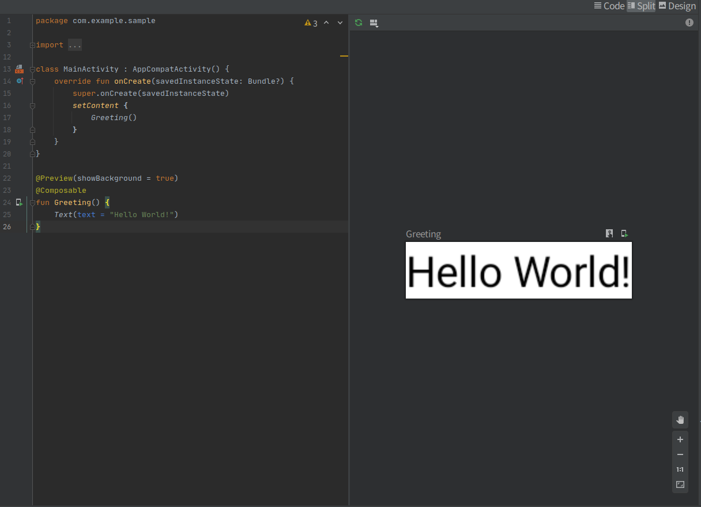
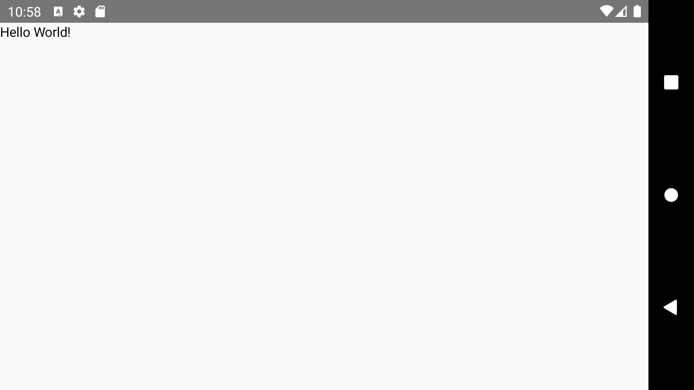

# 2020/08/30 ［Android］ Jetpack Compose  (alpha) で Hello World を表示する

# はじめに

最近やっと Jetpack Compose ですが alpha 版がリリースされたみたいですね。良い機会なので Jetpack Compose で宣言的な UI をどんな感じで記述できるのかやってみたいと思います。

# 準備
まず Jetpack Compose での開発をサポートするツールは Android Studio Canary (v4.2.0) にて対応されるみたいです。Jetpack Compose を始める際には Android Studio Canary (v4.2.0) をインストールする必要があるようです。

[Support for Jetpack Compose](https://developer.android.com/studio/preview/features#jetpack-compose)



なので Android Studio Canary は [Android Studio Preview](https://developer.android.com/studio/preview) からダウンロードしてインストールしました。インストール方法は OS によって異なりますが 筆者の環境は Ubuntu なので [［Android］Android Studio をインストールしショートカットを作成する](https://medium.com/kaleidot725/ubuntu-android-studio-をインストールしショートカットを作成する-32adf08234c9) を参考にしてインストールしました。


# プロジェクトを作る

開発環境が整ったのでさっそく Jetpack Compose を試すためのプロジェクトを作成します。Android Studio Canary (v4.2.0) だと Empty Compose Activity というのが用意されてたので選択してプロジェクトを作成します。


あとは通常の Android プロジェクトと同様に Name や Package.name などを指定して Finish をすべればプロジェクトの作成は完了です。


作成したプロジェクトは次のようなファイル構造になっていました。通常の `res/layout` にレイアウトを記述する XML ファイルが生成されますが Jetpack Compose ではもちろん XML でレイアウトを記述しないのでファイルが生成されていないですね。



# レイアウトを作成する

それでは Jetpack Compose でレイアウトを作成してみたいと思います。Jetpack Compose  では `Activity` の `onCreate` の `setContent` にレイアウトを記述していくようになっています。

```kotlin
class MainActivity : AppCompatActivity() {
    override fun onCreate(savedInstanceState: Bundle?) {
        super.onCreate(savedInstanceState)
        setContent {
            // ここにレイアウトを記述していく
        }
    }
}
```

`setContent` のブロックにレイアウトを記述するだけじゃなく関数に記述することもできます。関数にレイアウトを記述する場合は`@composable`をつける必要があるみたいです。

```kotlin
class MainActivity : AppCompatActivity() {
    override fun onCreate(savedInstanceState: Bundle?) {
        super.onCreate(savedInstanceState)
        setContent {
            Greeting()
        }
    }
}

@Composable
fun Greeting() {
    // ここにレイアウトを記述していく
}
```

また`@Preview` をつけると関数で生成されるレイアウトのプレビューができるようになっています。次のように`Activity`の隣にプレビュー画面が表示されてレイアウトが確認できるようになります。今までは`Activity`と`XML`を切り替えてレイアウトを確認する必要がありましたが切り替えの必要がなくなってかなり便利ですね。

```kotlin
@Preview(showBackground = true)
@Composable
fun Greeting() {
    // ここにレイアウトを記述していく
}
```



今回は Hello world !!  と表示できるようにレイアウトを組んでいきます。Jetpack Compose では Text を定義することで TextView に相当するものが定義されるようにです。なので Text を定義して Hello world!! を表示するようにします。

```kotlin
@Preview(showBackground = true)
@Composable
fun Greeting() {
    Text(text = "Hello World!")
}
```



ここまで実行すればあとはアプリを起動するだけです。   
起動すると次のように Hello World! が表示されるようになります。



# おわりに

Jetpack Compose (alpha) を使って Hello World を表示してみましたが宣言的に書けるというのはかなりメリットがありそうですね。特に`Activity` や `XML` を分けなくても記述できるというのはかなり便利だと思いました。ですが alpha のためかプレビューに上手く反映されないこともあり Jetpack Compose だけではなく Android Studio のツール周りに関してもまだまだ改善が必要かなという感じですね。ですがかなり好感触でした alpha が取れてプロダクトで使えるようになるが楽しみですね。

# 参考文献
- [Jetpack Compose の基本](https://developer.android.com/jetpack/compose/tutorial?return=https%3A%2F%2Fdeveloper.android.com%2Fcourses%2Fpathways%2Fcompose%23article-https%3A%2F%2Fdeveloper.android.com%2Fjetpack%2Fcompose%2Ftutorial)
