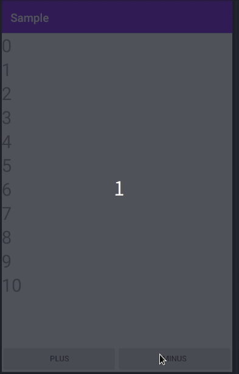
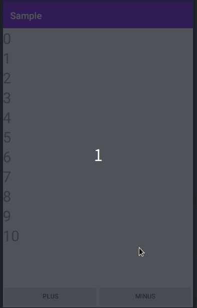

# 2020/09/05 ［Android］RecyclerView のアニメーションの時間を調整する

# はじめに

RecyclerView では ItemAnimator をセットすることでアニメーションを表示できるようになります。ItemAnimator は次のようなライブラリがあって好みのアニメーションに簡単に切り替えられるようになってます。

* [recyclerview-animators](https://github.com/wasabeef/recyclerview-animators)
* [ItemAnimators](https://github.com/mikepenz/ItemAnimators)

例えば [ItemAnimators](https://github.com/mikepenz/ItemAnimators) の ScaleUpAnimator を使ってアニメーションを実装すると次のような感じで表示されます。

```kotlin
    val scaleUpAnimator = ScaleUpAnimator()
    recycler_view.also { view ->
        // 省略 : Adapter や LayoutManager をセットアップする
        view.itemAnimator = scaleUpAnimator
    }
```



# 調整方法

こういったアニメーションをもう少し早くまたは遅くしたいときがあると思います。そういったときは setAddDuration、setChangeDuration、setMoveDuration、setRemoveDuration を設定することで簡単に時間を調節できます。

- [RecyclerView.ItemAnimator | setAddDuration](https://developer.android.com/reference/androidx/recyclerview/widget/RecyclerView.ItemAnimator#setAddDuration(long))
- [RecyclerView.ItemAnimator | setChangeDuration](https://developer.android.com/reference/androidx/recyclerview/widget/RecyclerView.ItemAnimator#setChangeDuration(long))
- [RecyclerView.ItemAnimator | setMoveDuration](https://developer.android.com/reference/androidx/recyclerview/widget/RecyclerView.ItemAnimator#setMoveDuration(long))
- [RecyclerView.ItemAnimator | setRemoveDuration](https://developer.android.com/reference/androidx/recyclerview/widget/RecyclerView.ItemAnimator#setRemoveDuration(long))a

例えば ScaleUpAnimator の setAddDuration と setRemoveDuration を変更してみます。すると追加と削除のときのアニメーションの表示間隔が変わります。

```kotlin
    val scaleUpAnimator = ScaleUpAnimator().apply {
        // 追加時のアニメーション間隔
        addDuration = 2000 
        // 削除時のアニメーション時間
        removeDuration = 4000
    }
    
    recycler_view.also { view ->
        // 省略 : Adapter や LayoutManager をセットアップする
        view.itemAnimator = scaleUpAnimator
    }
```




# おわりに

RecyclerView でのアニメーションの時間を調整するには次の特徴を理解する必要がある。

- RecyclerView では ItemAnimation をセットすることでアニメーションを変更できる
- RecyclerView でアニメーションの時間を調整する場合は ItemAniamtor の setAddDuration、setChangeDuration、setMoveDuration、setRemoveDuration で変更できる。

本記事の内容の動作確認をしたプロジェクトがこちらにあります。  
詳細を知りたいかたは以下を参照してください。


<a href="https://github.com/kaleidot725-android/item_animator"></a>