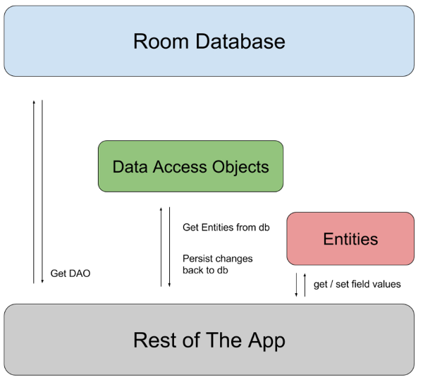
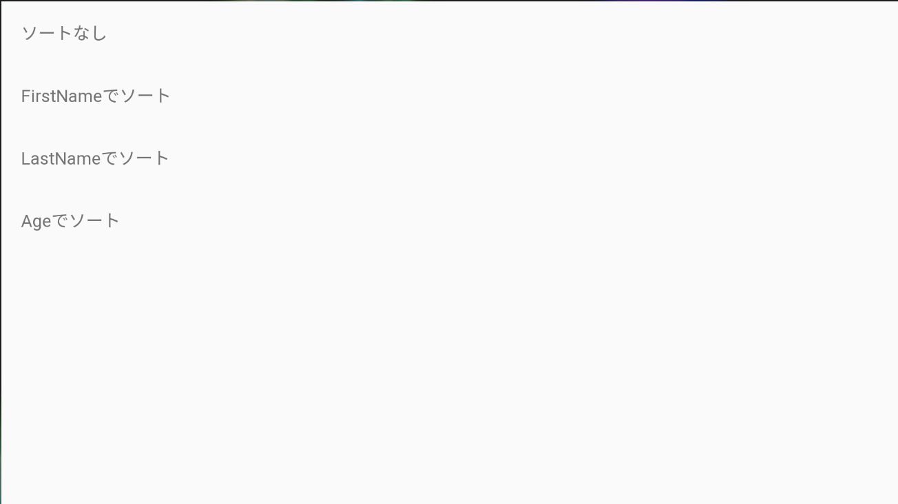
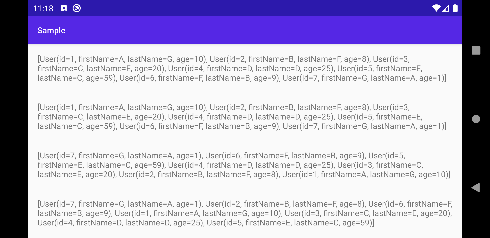

# ［Android］Coroutine Flow と Room を組み合わせる

# はじめに

Coroutine Flow と Room を組み合わせたサンプルを作成します。
アーキテクチャは Google が推奨している MVVM で作成を進めます。


# TL;DR

- Flow と Room を連携するときは Dao の戻り値を Flow にすればよい
- Room から取得した Flow は `asLiveData` で LiveData に変換できる。
- Flow を LiveData に変換したあとは、通常の LiveData と同じで Observe して利用する。

# Setup

アプリケーションの作成に必要となる、
Koin・Room・Flow(Coroutines)のライブラリをインストールする。

| ライブラリ | バージョン | 説明 |
| ------- | ------- | ------- |
| Koin | 2.1.3 | DIライブラリ |
| Room | 2.2.4 | 永続化を行うSQLiteを使いやすくしてくれるライブラリ |
| Coroutines | 1.3.4 | 非同期処理やノンブロッキング処理を行うためライブラリ |

```groovy
dependencies {
    　　　︙  
    def koin_version = "2.1.3"
    implementation "org.koin:koin-android:$koin_version"
    implementation "org.koin:koin-android-scope:$koin_version"
    implementation "org.koin:koin-android-viewmodel:$koin_version"
    implementation "org.koin:koin-android-ext:$koin_version"
  
    def room_version = "2.2.4"
    implementation "androidx.room:room-runtime:$room_version"
    implementation "androidx.room:room-ktx:$room_version"
    kapt "androidx.room:room-compiler:$room_version"

    def coroutines_version = "1.3.4"
    implementation "org.jetbrains.kotlinx:kotlinx-coroutines-core:$coroutines_version"

    def lifecycle_version = "2.2.0"
    implementation "androidx.lifecycle:lifecycle-viewmodel-ktx:$lifecycle_version"
    implementation "androidx.lifecycle:lifecycle-livedata-ktx:$lifecycle_version"
}
```

# Model
Room を利用してデータを永続化する層を作成する。
Room を利用するには次のクラスが必要になるので実装していく。

| 役割 | クラス名 | 役割 |
| ------- | ------- | -------- |
| Entity | User | データベースのテーブルを表すクラス |
| Data Access Objects | UserDao | データベースにアクセスするメソッドを定義するクラス |
| Room Database | Database | Dao を生成するための RoomDatabase を継承した抽象クラス |
| Repository | UserRepository | UserDao を利用してデータにアクセスするクラス |


**Entity**

ID, FirstName, LastName Age を持つ User クラスを用意する。
```kotlin
@Entity(tableName = "users")
data class User(
    @PrimaryKey(autoGenerate = true) val id: Int,
    @ColumnInfo(name = "first_name") val firstName: String?,
    @ColumnInfo(name = "last_name") val lastName: String?,
    val age: Int
)
```

**Data Access Objects**
定義した User クラスを追加, 削除, 全削除, 全取得するクラスを定義する。Flow と連携したい場合は User 関数の戻り値に `Flow<T>` とします。そうすれば Room が勝手に `Flow<T>` を返すようにしてくれる。

```kotlin
@Dao
interface UserDao {
    @Insert
    fun insert(user : User)

    @Delete
    fun delete(user : User)

    @Query("delete from users")
    fun deleteAll()

    @Query("select * from users")
    fun getAll(): Flow<List<User>>
}
```

**Room Database**
Database を作成しを生成し、取得する RoomDatabase クラスを定義する。

```kotlin
@Database(entities = arrayOf(User::class), version = 1)
abstract class Database : RoomDatabase() {
    abstract fun userDao(): UserDao
}
```


**Repository**
Data Access Object を利用してデータを取得する Repository を作成する。UserDao は単純に CRUD 実行するクラスですが、Repository にはソートなどアプリが要求する形にデータを加工する機能を実装する。

```kotlin
class UserRepository(private val userDao: UserDao) {
    fun getUsers() = userDao.getAll()

    fun getUserSortedByFirstName() = getUsers().map {
            it -> it.sortedBy { it.firstName }
    }

    fun getUserSortedByLastName() = getUsers().map {
            it -> it.sortedBy { it.lastName }
    }

    fun getUserSortedByAge() = getUsers().map {
            it -> it.sortedBy { it.age }
    }

    // サンプルデータを生成するために定義、普段は必要ない関数です。
    fun tryUpdateRecentUsersCache() {
        userDao.deleteAll()
        userDao.insert(User(1, "A", "G", 10))
        userDao.insert(User(2, "B", "F", 8))
        userDao.insert(User(3, "C", "E", 20))
        userDao.insert(User(4, "D", "D", 25))
        userDao.insert(User(5, "E", "C", 59))
        userDao.insert(User(6, "F", "B", 9))
        userDao.insert(User(7, "G", "A", 1))
    }
}
```

## ViewModel

`Flow<T>` は `asLiveData()` で `LiveData<T>` に変換できる。
ViewModel では Viewが`LiveData<T>`を購読できるよう、
Repository から取得した `Flow<T>` を `LiveData<T>` に変換する。

```Kotlin
class MainViewModel(
  private val repo: UserRepository
): ViewModel() {
    val users: LiveData<List<User>> 
  			= repo.getUsers().asLiveData()
    val usersSortedByFirstName: LiveData<List<User>> 
  			= repo.getUserSortedByFirstName().asLiveData()
    val usersSortedByLastName: LiveData<List<User>> 
  			= repo.getUserSortedByLastName().asLiveData()
    val usersSortedByAge: LiveData<List<User>> 
  			= repo.getUserSortedByAge().asLiveData()
}
```

サンプルデータを書き込む処理を`init`に追加する、
本来は必要のないので必要に応じて追加・削除してください。

```Kotlin
init {
    viewModelScope.launch(Dispatchers.IO) {
        repo.tryUpdateRecentUsersCache()
    }
}
```

## View

**Koin**

ViewModel を生成するため Koin の AppModule を定義する。
次の手順で RoomDatabase, UserDao, UserRepository を生成し、MainViewModel を生成する。

```Kotlin
val appModule = module {
    single {
        Room.databaseBuilder(androidContext(), Database::class.java, "users").build()
    }

    single {
        get<Database>().userDao()
    }

    single {
        UserRepository(get())
    }

    viewModel {
        MainViewModel(get())
    }
}
```

**MainActivity**

AppModule を利用して Koin を初期化し、 viewModel を取得できるようにする。
そして ViewModel をバインディング、また ViewModel の LiveData を Observe する。
Observe したデータは用意した TextView に表示するようにする。

```kotlin
class MainActivity : AppCompatActivity() {
    private val viewModel : MainViewModel by viewModel()

    override fun onCreate(savedInstanceState: Bundle?) {
        super.onCreate(savedInstanceState)
 
        // Koin の初期化
        startKoin {
            androidLogger()
            androidContext(applicationContext)
            modules(appModule)
        }

        val binding : ActivityMainBinding =
            DataBindingUtil.setContentView(this, R.layout.activity_main)
        binding.viewModel = viewModel

        viewModel.users.observe(this, Observer {
            binding.mainText.text = it.toString()
        })

        viewModel.usersSortedByFirstName.observe(this, Observer {
            binding.sortFirstNameText.text = it.toString()
        })

        viewModel.usersSortedByLastName.observe(this, Observer {
            binding.sortLastNameText.text = it.toString()
        })

        viewModel.usersSortedByAge.observe(this, Observer {
            binding.sortAgeText.text = it.toString()
        })
    }
}
```



```XML
<layout>

    <data>
        <variable
            name="viewModel"
            type="kaleidot725.sample.ui.MainViewModel" />
    </data>

    <LinearLayout
        xmlns:android="http://schemas.android.com/apk/res/android"
        xmlns:app="http://schemas.android.com/apk/res-auto"
        xmlns:tools="http://schemas.android.com/tools"
        android:layout_width="match_parent"
        android:layout_height="match_parent"
        android:orientation="vertical"
        tools:context=".ui.MainActivity">

        <TextView
            android:id="@+id/main_text"
            android:layout_width="match_parent"
            android:layout_height="wrap_content"
            android:layout_margin="16dp"/>

        <TextView
            android:id="@+id/sort_first_name_text"
            android:layout_width="match_parent"
            android:layout_height="wrap_content"
            android:layout_margin="16dp"/>

        <TextView
            android:id="@+id/sort_last_name_text"
            android:layout_width="match_parent"
            android:layout_height="wrap_content"
            android:layout_margin="16dp"/>

        <TextView
            android:id="@+id/sort_age_text"
            android:layout_width="match_parent"
            android:layout_height="wrap_content"
            android:layout_margin="16dp"/>
    </LinearLayout>
</layout>
```

# おわりに

アプリケーションを起動すると、Observe した時点でデータ取得し、TextView に結果が表示される。


