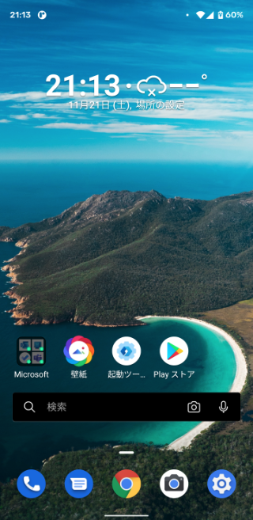
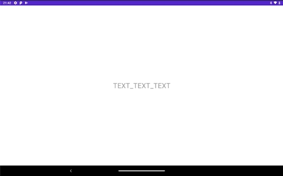

# 2020/11/21 ［Android］ホーム・ランチャーアプリとして起動できるようにする

Android では Home ボタンを押したときに特定のアプリを表示するようになっています。これを一般的にホームアプリやランチャーアプリと言います。例えば Microsoft Launcher などですねこれらをホーム・ランチャーアプリと呼びます。




ホーム・ランチャーアプリとして起動するには AndroidManifest.xml の Category に `android.intent.category.LAUNCHER` と `android.intent.category.DEFAULT` を追加します。`android.intent.category.LAUNCHER` はこのアプリのカテゴリをランチャーアプリとするもので、`android.intent.category.DEFAULT` は暗黙的インテントを受け取れるようにするものらしいです。`android.intent.category.LAUNCHER` だけを設定すればランチャーアプリになるのではと思ってしまいますが、ランチャーアプリにするには暗黙的インテントを受け取れなければならないみたいです。

```xml
<?xml version="1.0" encoding="utf-8"?>
<manifest xmlns:android="http://schemas.android.com/apk/res/android"
    package="jp.kaleidot725.sample">

    <application
        android:allowBackup="true"
        android:icon="@mipmap/ic_launcher"
        android:label="@string/app_name"
        android:roundIcon="@mipmap/ic_launcher_round"
        android:supportsRtl="true"
        android:theme="@style/Theme.Sample">
        <activity
            android:name=".MainActivity"
            android:label="@string/app_name"
            android:theme="@style/Theme.Sample.NoActionBar"> 
            <intent-filter>
                <action android:name="android.intent.action.MAIN" />
                <category android:name="android.intent.category.HOME" />
                <!-- 追加 -->
                <category android:name="android.intent.category.LAUNCHER" />
                <category android:name="android.intent.category.DEFAULT" />
                <!--------->
          </intent-filter>
        </activity>
    </application>
</manifest>
```

AndroidManifest.xml を編集したらあとはアプリを起動するだけです。このとおりランチャーアプリとして認識され、Home ボタンを押したときに表示するようにできます。


