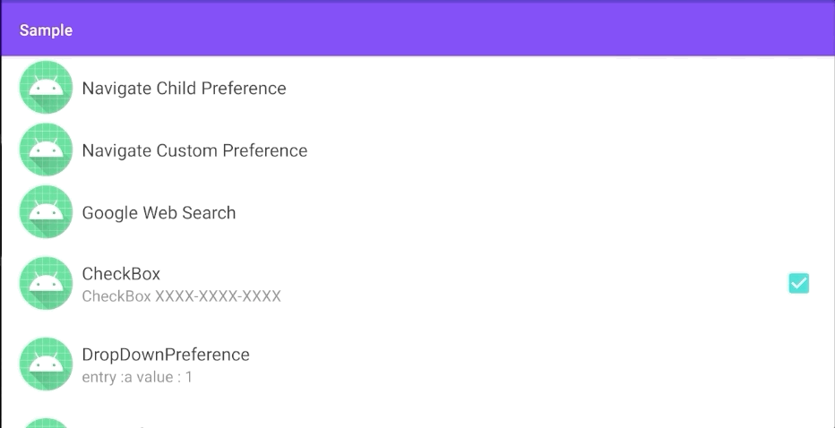
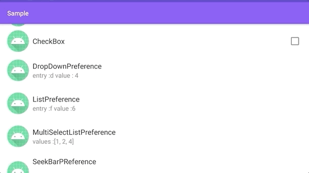
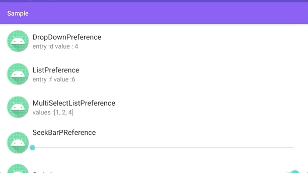
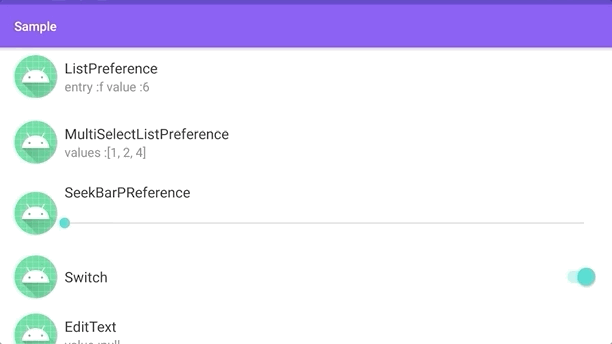
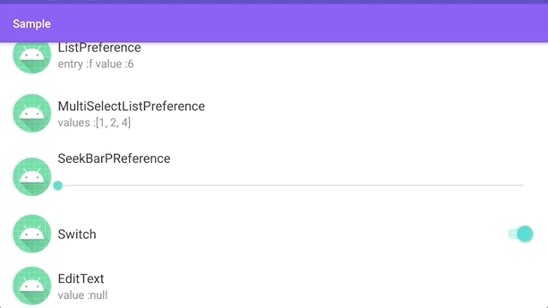
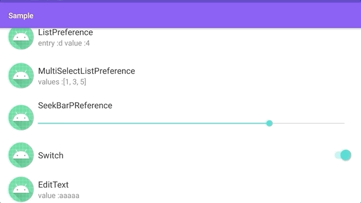
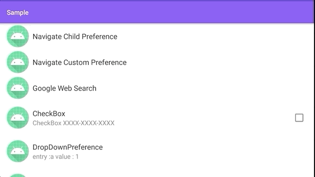

# 2020/07/17 ［Android］AndroidX Preference Library を使って設定画面を作成する

# はじめに

Android では Preference Library を使うことで簡単に設定画面を作ることができるようになっています。今回は Preference Library をどのように使えるのか簡単にまとめたいと思います。

<a href="https://gyazo.com/822ec1fcc15e445f33f984b22c54d186"></a>

# インストール

Preference Library を build.gradle(app) の依存関係に追加します。追加しなくてもコード補完候補にクラス名称が出てくることがありますが古いライブラリが参照されて上手く動作しないので依存関係は追加したほうが良いです。

```groovy
dependencies {
    def preference_version = "1.1.1"
    implementation "androidx.preference:preference-ktx:$preference_version"
}
```


# 設定画面の作り方

Preference Library を利用して設定画面を作成するときには次の手順で作成します。

1. 設定画面を XML ファイルに定義する。
2. 設定画面（XMLファイル）を表示する PreferenceFragmentCompat を作成する。
3. PreferenceFragmentCompat を Activity で表示してやる

## 1. 設定画面を XML ファイルに定義する。

Preference Library では XMLファイルを res/xml フォルダに作成して設定画面を定義します。Preference Library では大まかに 3 つの要素が用意されており、これらの要素を配置することで設定画面を定義していきます。

| 名称               | 解説                                                     |
| ------------------ | -------------------------------------------------------- |
| PreferenceScreen   | 複数の Preference を格納するためのコンテナでルートの要素 |
| PreferenceCategory | 複数の Preference をカテゴリ別にするための要素           |
| Preference         | 設定項目を定義するための要素                             |

また PreferenceCategory や Preferenceには attribute を定義することで見た目を変更します。代表的なものとしては次の3つがあります。attribute に関しては Preference の種類ごとに異なるので公式ドキュメントを確認してみてください。

| 名称        | 解説                   |
| ----------- | ---------------------- |
| app:icon    | 項目に表示するアイコン |
| app:title   | 項目に表示するタイトル |
| app:summary | 項目に表示するテキスト |

```xml
<?xml version="1.0" encoding="utf-8"?>
<?xml version="1.0" encoding="utf-8"?>
<PreferenceScreen xmlns:android="http://schemas.android.com/apk/res/android"
    xmlns:app="http://schemas.android.com/apk/res-auto">

    <PreferenceCategory
        app:key="preferenceCategory"
        app:icon="@mipmap/ic_launcher"
        app:title="Category"
        app:summary="Category Summary">

        <CheckBoxPreference
            app:icon="@mipmap/ic_launcher"
            app:key="checkBoxPreference"
            app:summary="CheckBox XXXX-XXXX-XXXX"
            app:title="CheckBox"/>
    </PreferenceCategory>

</PreferenceScreen>
```

このように Preference Library を使った設定画面の作成は通常のレイアウトファイルを記述するのと同じ要領で作成できるようになっています。もちろん次のように作成した設定画面は Android Studio で Preview もできるようになっています。

<a href="https://gyazo.com/49820a8aeab0eb381d49ac28e0e3069b"></a>

## 2. 設定画面(XMLファイル)を表示する PreferenceFragmentCompat を作成する。

あとは PreferenceFragmentCompat というクラスを定義して XML ファイルを読み込むようにします。次のように onCreatePreferences を override して setPreferencesFromResource にて XML ファイルを指定してやればOKです。

```kotlin
class ParentPreferenceFragment : PreferenceFragmentCompat() {
    override fun onCreatePreferences(savedInstanceState: Bundle?, rootKey: String?) {
        setPreferencesFromResource(R.xml.parent_preferences, rootKey)
    }
}
```

## 3. PrerenceFragmentCompat を Activiy で表示してやる。

あとは作成した PreferenceFragmentCompat を通常の Fragment と同じように Activity に配置してやるだけです。あとはアプリを起動してやれば XML ファイルに定義した設定画面が表示され変更できるようになります。

```kotlin
class MainActivity : AppCompatActivity(R.layout.activity_main)
```

```xml
<?xml version="1.0" encoding="utf-8"?>
<androidx.constraintlayout.widget.ConstraintLayout xmlns:android="http://schemas.android.com/apk/res/android"
    xmlns:app="http://schemas.android.com/apk/res-auto"
    xmlns:tools="http://schemas.android.com/tools"
    android:layout_width="match_parent"
    android:layout_height="match_parent"
    tools:context=".MainActivity">

    <androidx.fragment.app.FragmentContainerView
        android:id="@+id/fragment_container"
        android:layout_width="match_parent"
        android:layout_height="match_parent"
        android:name="jp.kaleidot725.sample.setting.ParentPreferenceFragment"
        app:layout_constraintBottom_toBottomOf="parent"
        app:layout_constraintLeft_toLeftOf="parent"
        app:layout_constraintRight_toRightOf="parent"
        app:layout_constraintTop_toTopOf="parent" />

</androidx.constraintlayout.widget.ConstraintLayout>
```

<a href="https://gyazo.com/43c903339094ec17f79eaf8a27632a61"></a>
# 設定を読み込む

Preference Library で用意された　Preference には変更した設定値を Shared Preference に保存する機能が実装されています。Preference の attirbute の app:key を定義するだけでこの機能は有効になり、指定したキーで SharedPreference に設定値が保存されます。

```xml
<?xml version="1.0" encoding="utf-8"?>
<PreferenceScreen xmlns:android="http://schemas.android.com/apk/res/android"
    xmlns:app="http://schemas.android.com/apk/res-auto">

    <PreferenceCategory
        app:key="preferenceCategory"
        app:icon="@mipmap/ic_launcher"
        app:title="Category"
        app:summary="Category Summary">

        <CheckBoxPreference
            app:icon="@mipmap/ic_launcher"
            app:key="checkBoxPreference"
            app:summary="CheckBox XXXX-XXXX-XXXX"
            app:title="CheckBox"/>
    </PreferenceCategory>

</PreferenceScreen>
```

また保存された設定値は設定画面を開いたときに自動的に読み込まれるようになっています。Preference Library を使った設定値の保存はものすごく簡単でライブラリ側が全部やってくれるようになっています。

<a href="https://gyazo.com/822ec1fcc15e445f33f984b22c54d186"></a>

SharedPreference に保存されているので設定値の読み込みも簡単です。次のコードで SharedPreference を取得して、Preferenceに指定した Key を指定して値を取得すればOKです。

```kotlin
val sharedPreferences = PreferenceManager.getDefaultSharedPreferences(this)
val checkStatus = sharedPreferences.getBoolean("checkBoxPreference", false)
Log.v("TAG", "CheckStatus $checkStatus")
```

# おわりに

- AndroidX Preference Library を使うと簡単に設定画面を作れる。
- PreferenceScreen は PreferenceCategory や Preference を格納するための要素
- PreferenceCategory は Preference をカテゴリ別にまとめるための要素
- Preference は設定項目の要素で CheckBox を持ったものや EditText を持つものがある。
- Preference には icon や title、 summary などの attribute が用意されていて見た目をカスタマイズできる
- Preference に key を設定すると SharedPreference にそのキーで設定値が保存されるようになる。保存された設定値は Preference を再表示した際に自動的に読み込まれる。保存された設定値は 通常の SharedPreference の読み込み処理で読み込むことができる。

# 参考文献

- [設定 | Android Developers](https://developer.android.com/guide/topics/ui/settings)
- [androidx.preference](https://developer.android.com/jetpack/androidx/releases/preference#version_111_3) 
- [kaleidot-725/preference](https://github.com/kaleidot725-android/preference)

# 2020/08/08［Android］AndroidX Preference Library で作れる設定画面まとめ

# はじめに

AndroidX Preference Library でどのような設定画面が実装できるのかまとめが欲しかったので作成しました。基本的な使い方は[こちら](https://qiita.com/kaleidot725/items/f9ce2fbbf479d2a9f2bb)にまとめていますので参考にしてみてください。

| 要素                      | 説明                                                 | 見た目                                                       |
| ------------------------- | ---------------------------------------------------- | ------------------------------------------------------------ |
| Preference                | Fragmentへの遷移や Intent を発行するときに利用する。 |        |
| CheckBoxPreference        | チェックボックスで値を設定する。                     |  |
| DropDownPreference        | ドロップダウンリストから選択する。                   |                   |
| ListPreference           | 指定したリストをダイアログで選択する                 |               |
| MultiSelectListPreference | 設定したリストをダイアログで複数選択する。           |                  |
| SeekBarPreference         | シークバーにて値を指定する                           |                    |
| SwitchPreferenceCompat    | スイッチで値を設定する。                             |                 |
| EditTextPreference        | 文字入力ダイアログにて文字列を設定する。             |                  |
# Preference

Preference は設定画面にて他の Fragment への遷移、 Intent の発行する時に使える。

### Fragment に遷移する

Preference をクリックしたときに他の Fragment に遷移することができます。
遷移するにはまず`app:Fragment`に Fragment を指定する必要があります。

```xml
    <Preference
        app:fragment="jp.kaleidot725.sample.setting.ChildPreferenceFragment"
        app:icon="@mipmap/ic_launcher_round"
        app:key="childPreferenceFragment"
        app:title="Navigate Child Preference" />
```

`app:fragment` を指定すると`PreferenceFragmentCompat.OnPreferenceStartFragmentCallback` を通して指定した Fragment のクラス情報が渡されるようになります。なので渡された情報から Fragment を生成して遷移してやります。

```kotlin
class MainActivity : AppCompatActivity(R.layout.activity_main), PreferenceFragmentCompat.OnPreferenceStartFragmentCallback{
    override fun onPreferenceStartFragment(caller: PreferenceFragmentCompat, pref: Preference): Boolean {
        val fragment = supportFragmentManager.fragmentFactory.instantiate(classLoader, pref.fragment).apply {
            arguments = pref.extras
            setTargetFragment(caller, 0)
        }
        supportFragmentManager.beginTransaction().replace(R.id.fragment_container, fragment).addToBackStack(null).commit()
        return true
    }
}
```

そうすると次のように Fragment に遷移できるようになります。遷移する Fragment は特に制約などありませんので Preference を使った Fragment を実装して遷移すれば設定画面の階層を定義できます。


### Intent を発行する

Preference をクリックしたときに Intent を発行することもできます。
次のように Intent を指定すれば、特定の Web ページを開くことができます。

```xml
    <Preference
        app:icon="@mipmap/ic_launcher_round"
        app:key="intent"
        app:title="Google Web Search">
        <intent
            android:action="android.intent.action.VIEW"
            android:data="http://www.google.com" />

    </Preference>
```



## CheckBoxPreference

CheckBoxPreference を使えば CheckBox を表示できます。
CheckBox なので true と false の ブール値を設定できます。

```xml
    <CheckBoxPreference
        app:icon="@mipmap/ic_launcher"
        app:key="checkBoxPreference"
        app:title="CheckBox" />
```


## SwitchPreferenceCompat

CheckBoxPreference を使えば Switch を表示できます。
Switch なので true と false の ブール値を設定できます。

```xml
    <SwitchPreferenceCompat
        app:icon="@mipmap/ic_launcher_round"
        app:key="switchPreference"
        app:summary="Enable XXXX-XXXX-XXXX"
        app:title="Switch" />
```


## DropDownPreference

DropDownPrefrence を使えば、次のようなリストのダイアログを表示できます。
リストに表示する項目の名称は `entries` 項目の値は `entryValues` にセットします。

```xml
    <DropDownPreference
        app:entries="@array/entries"
        app:entryValues="@array/entryValues"
        app:icon="@mipmap/ic_launcher"
        app:key="dropDownPreference"
        app:title="DropDownPreference"
        app:useSimpleSummaryProvider="true" />
```

`entries` や `entryValues` にセットする値は `values/array.xml` にあらかじめ定義しておく必要があります。

```xml
<?xml version="1.0" encoding="utf-8"?>
<resources>
    <string-array name="entries">
        <item>a</item>
        <item>b</item>
        <item>c</item>
        <item>d</item>
        <item>e</item>
        <item>f</item>
        <item>g</item>
        <item>h</item>
    </string-array>

    <string-array name="entryValues">
        <item>1</item>
        <item>2</item>
        <item>3</item>
        <item>4</item>
        <item>5</item>
        <item>6</item>
        <item>7</item>
        <item>8</item>
    </string-array>
</resources>
```


## ListPreference

ListPreference を使えば、次のようなリストのダイアログを表示できます。
リストに表示する項目の名称は `entries` 項目の値は `entryValues` にセットします。

```xml
    <ListPreference
        app:entries="@array/entries"
        app:entryValues="@array/entryValues"
        app:icon="@mipmap/ic_launcher"
        app:key="listPreference"
        app:title="ListPreference"
        app:useSimpleSummaryProvider="true" />
```

`entries` や `entryValues` にセットする値は `values/array.xml` にあらかじめ定義しておく必要があります。

```xml
<?xml version="1.0" encoding="utf-8"?>
<resources>
    <string-array name="entries">
        <item>a</item>
        <item>b</item>
        <item>c</item>
        <item>d</item>
        <item>e</item>
        <item>f</item>
        <item>g</item>
        <item>h</item>
    </string-array>

    <string-array name="entryValues">
        <item>1</item>
        <item>2</item>
        <item>3</item>
        <item>4</item>
        <item>5</item>
        <item>6</item>
        <item>7</item>
        <item>8</item>
    </string-array>
</resources>
```


## MultiSelectListPreference

MultiSelectListPreference を使えば、次のような複数選択できるリストのダイアログを表示できます。
リストに表示する項目の名称は `entries` 項目の値は `entryValues` にセットします。

```xml
    <MultiSelectListPreference
        app:entries="@array/entries"
        app:entryValues="@array/entryValues"
        app:icon="@mipmap/ic_launcher"
        app:key="multiSelectListPreference"
        app:title="MultiSelectListPreference" />
```

`entries` や `entryValues` にセットする値は `values/array.xml` にあらかじめ定義しておく必要があります。

```xml
<?xml version="1.0" encoding="utf-8"?>
<resources>
    <string-array name="entries">
        <item>a</item>
        <item>b</item>
        <item>c</item>
        <item>d</item>
        <item>e</item>
        <item>f</item>
        <item>g</item>
        <item>h</item>
    </string-array>

    <string-array name="entryValues">
        <item>1</item>
        <item>2</item>
        <item>3</item>
        <item>4</item>
        <item>5</item>
        <item>6</item>
        <item>7</item>
        <item>8</item>
    </string-array>
</resources>
```


## SeekBarPreference

SeekBarPrefrence を使えば次のような SeekBar を表示できます。
SeekBar の最大値は `android:max` 最小値は `app:min` でセットします。

```xml
    <SeekBarPreference
        app:icon="@mipmap/ic_launcher"
        app:key="seekBarPreference"
        android:max="99"
        app:min="1"
        app:title="SeekBarPReference" />
```


## EditTextPreference

EditTextPreference を使えば次のような文字を入力するダイアログを表示できます。

```xml
    <EditTextPreference
        app:icon="@mipmap/ic_launcher"
        app:key="editTextPreference"
        app:title="EditText"
        app:useSimpleSummaryProvider="true" />
```

# おわりに

というように基本的な設定画面を作るためのものは用意されていて、もし独自の設定画面が必要であれば Fragment を実装できるような仕組みになっています。
なので AndroidX Preference Library を使えば設定画面の作成で困ることはなさそうです。
