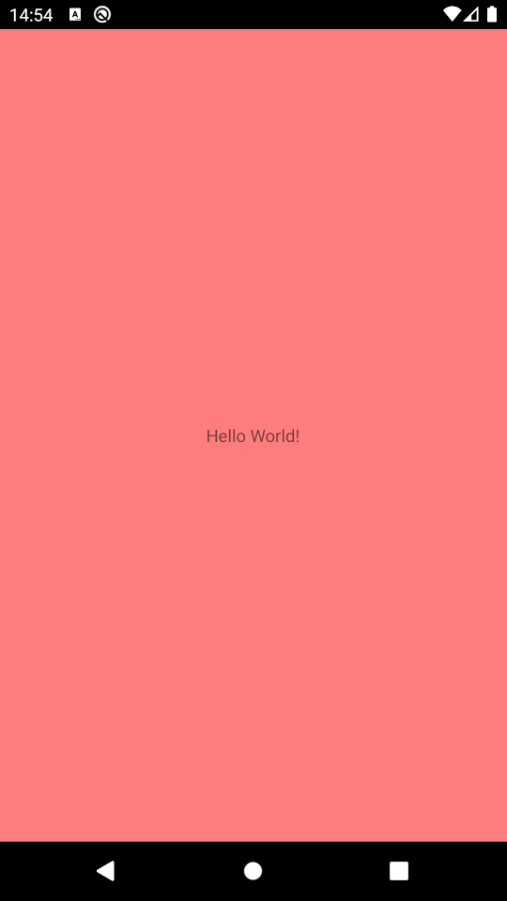
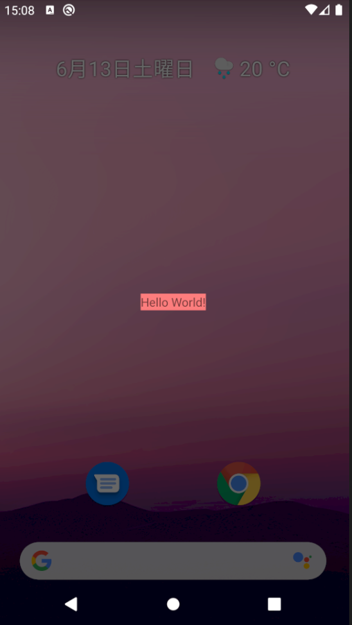
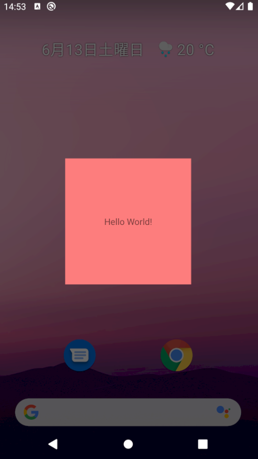

# 2020/06/13 ［Android］WindowIsFloating の動作を確認する

# はじめに

Activity や DialogFragment の設定には WindowIsFloating がありますが、これがドキュメントを見ただけではどんな動作をするかわかりません。WindowIsFloating を True にしたときには独特の挙動があり分かりづらい点がありました。今回は WindowIsFloating の動作と注意点を備忘録としてまとめられたらなと思います。

# WindowIsFloating とは？

WindowIsFloating は Window を浮遊したような感じに表示させるためのフラグになります。下記のような感じで Styles.xml にて変更し、AndroidManifest.xml で適用すれば WindowIsFloating の設定が反映され見た目が変わるようになります。

**Styles.xml の Style の Item として android:windowIsFloatin を指定してやる**
```xml
<resources>
    <style name="AppTheme" parent="Theme.AppCompat.Light.DarkActionBar">
        <item name="android:windowIsFloating">false</item>
        <item name="windowNoTitle">true</item>
    </style>
</resources>
```

**AndroidManifest.xml の application の android:theme で設定する**

```xml
<?xml version="1.0" encoding="utf-8"?>
<manifest xmlns:android="http://schemas.android.com/apk/res/android"
    package="jp.kaleidot725.sample">

    <application
        android:allowBackup="true"
        android:icon="@mipmap/ic_launcher"
        android:label="@string/app_name"
        android:roundIcon="@mipmap/ic_launcher_round"
        android:supportsRtl="true"
        android:theme="@style/AppTheme">
        <activity android:name=".MainActivity">
            <intent-filter>
                <action android:name="android.intent.action.MAIN" />

                <category android:name="android.intent.category.LAUNCHER" />
            </intent-filter>
        </activity>
    </application>

</manifest>
```

# WindowIsFloating を設定してみる
次のレイアウトの MainActivity を用意して、WindowIsFloating を False または True にした場合にどのように見た目が変わるのか検証してみます。

```xml
<?xml version="1.0" encoding="utf-8"?>
<androidx.constraintlayout.widget.ConstraintLayout xmlns:android="http://schemas.android.com/apk/res/android"
    xmlns:app="http://schemas.android.com/apk/res-auto"
    xmlns:tools="http://schemas.android.com/tools"
    android:layout_width="match_parent"
    android:layout_height="match_parent"
    android:minWidth="200dp"
    android:minHeight="200dp"
    android:background="#80ff0000"
    tools:context=".MainActivity">

    <TextView
        android:layout_width="wrap_content"
        android:layout_height="wrap_content"
        android:text="Hello World!"
        app:layout_constraintBottom_toBottomOf="parent"
        app:layout_constraintLeft_toLeftOf="parent"
        app:layout_constraintRight_toRightOf="parent"
        app:layout_constraintTop_toTopOf="parent" />

</androidx.constraintlayout.widget.ConstraintLayout>
```

WindowIsFloating を False にするとこのようにいつもどおりの Activity が表示されます。Trueにするとこのように浮かんでいるような見た目になります。True にした場合は ConstraintLayout の layout_width や layout_height の match_parent が機能せずに ConstraintLayout 内の View を ラップした形で表示されてしまうみたいですね。

| WindowIsFloating == false | WindowIsFloating == true |
| ------- | ------- |
|  |  |

# WindowIsFloating を True の時に表示サイズを変えたい

いろいろ試して見た感じだと layout_width や layout_height を変更しても View ラップされてしまう挙動はかわらないみたいです。どうしても View がラップされた表示を避けたい場合には、 android:minWidth と android:minHeight で最小の大きさを定義してやると上手くいきそうです。


```xml
<?xml version="1.0" encoding="utf-8"?>
<androidx.constraintlayout.widget.ConstraintLayout xmlns:android="http://schemas.android.com/apk/res/android"
    xmlns:app="http://schemas.android.com/apk/res-auto"
    xmlns:tools="http://schemas.android.com/tools"
    android:layout_width="match_parent"
    android:layout_height="match_parent"
    android:minWidth="200dp"
    android:minHeight="200dp"
    android:background="#80ff0000"
    tools:context=".MainActivity">

    <TextView
        android:layout_width="wrap_content"
        android:layout_height="wrap_content"
        android:text="Hello World!"
        app:layout_constraintBottom_toBottomOf="parent"
        app:layout_constraintLeft_toLeftOf="parent"
        app:layout_constraintRight_toRightOf="parent"
        app:layout_constraintTop_toTopOf="parent" />

</androidx.constraintlayout.widget.ConstraintLayout>
```

| minWidht minHeight なし | minWidht minHeight あり |
| ------- | ------- |
|  |  |

# おわりに

Android 流儀に逆らった実装をする場合には WindowIsFloating を使うシチュエーションがあるかもですね。基本は WindowIsFloating については挙動は面倒なので触りたくないなと思いました。


ちなみに今回作成したサンプルはこちらにあります。

<a href="https://github.com/kaleidot725-android/window_is_floating"></a>
# 参考資料

- [WindowIsFloating | Android Developers](https://developer.android.com/reference/android/R.attr#windowIsFloating)